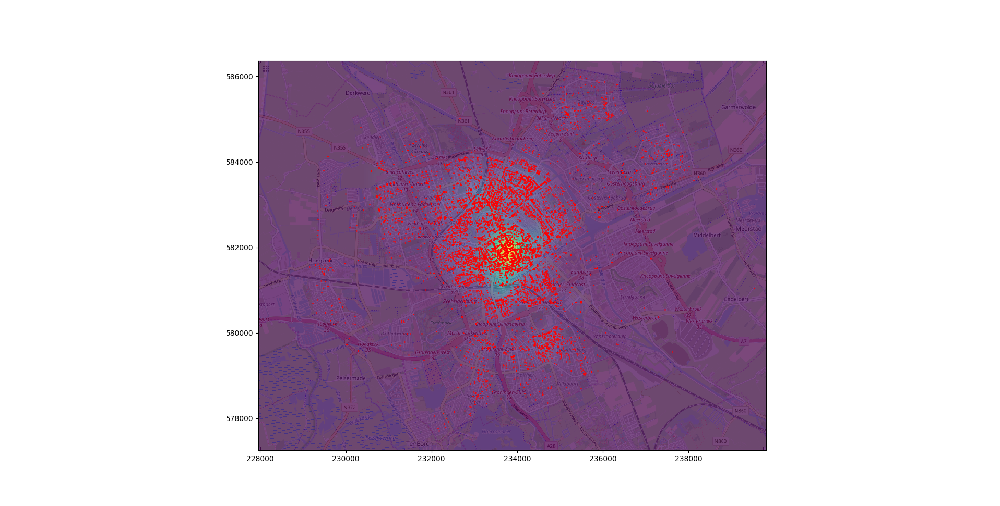
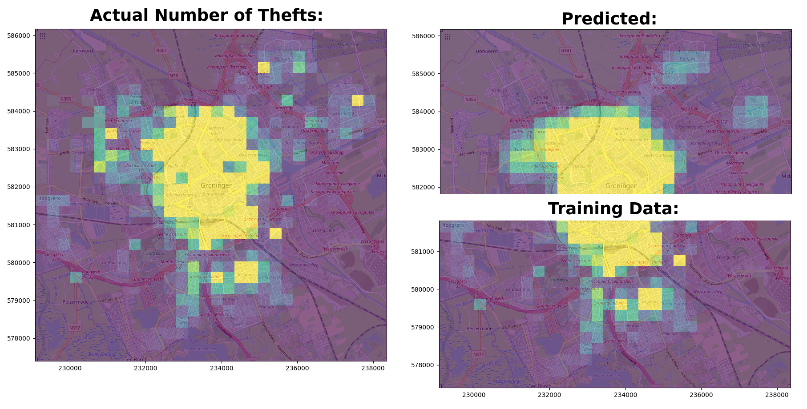

All code in this directory is released under the AGPL-3.0 unless stated/applicable otherwise: https://www.gnu.org/licenses/agpl-3.0.en.html
Contact: https://github.com/r-snijders

# Kernel Density Estimation (KDE)

Use the `kernen_density_estimation.py` script to calculate the KDE of thefts of Groningen over the complete dataset as follows:

`./kernel_density_estimation.py --method full ../../data/fietsendiefstallen.tsv`

Run the script with the `-h` option to see more options.

Example result:

## Create Movies

Using a different `--method` allows to create a movie by calculating the KDE over several window intervals.

For example, the following command:

`./kernel_density_estimation.py --method diff_double ../data/fietsendiefstallen.tsv`

Will create multiple frames under the directory `output` which in turn can be converted into a movie using the following command (under GNU/Linux):
`ffmpeg -f image2 -i ./output/%4d.png -crf 0 -b 1000k movie.avi`

# Creating Dataset

One can create a dataset using the following command (using option `-h` for more info):

`./create_grid_dataset.py --grid 30 --csvs ../../dataset_input/ ./output/fietsendiefstallen_with_grid.tsv dataset.csv`

Make sure to put any csv files you want to use to extract the features from under the direction specified with the option `--csvs`.
The csv files used for the feature are assumed to contain a `x` and `y` column indicating the `lat/lot` values of the location.

How it works:
* First the map is assigned to a grid of a given resolution (by default one of 30x30). 
* Then, for each csv file, a KDE is calculated using the locations of the objects (camera's, busstops, etc.).
* For each cel in the grid, the density value of each of the calculated KDE's are calculated.
* The result is a feature vector with the same length as the number of csvs specified in the directory. And for each feature vector the number of thefts found in the corresponding cel.

NOTE: One can fine-tune the influence of each object using the `bw_method` option in the statement `stats.gaussian_kde(values, bw_method=10.0)` inside the code.

# Training and Testing the Predictor

A Multi Layer Perceptron Regressor (with three hidden layers with the following amount of neurons; 100, 200, 100) is used to train on the bottom half of the city in order to predict the number of bike thefts in five years for the upper half of the city:

This result can be reproduced using the following command (use option `-h` for more options):

`./predictor.py -tp 0.5 dataset_reversed_xy.csv`
